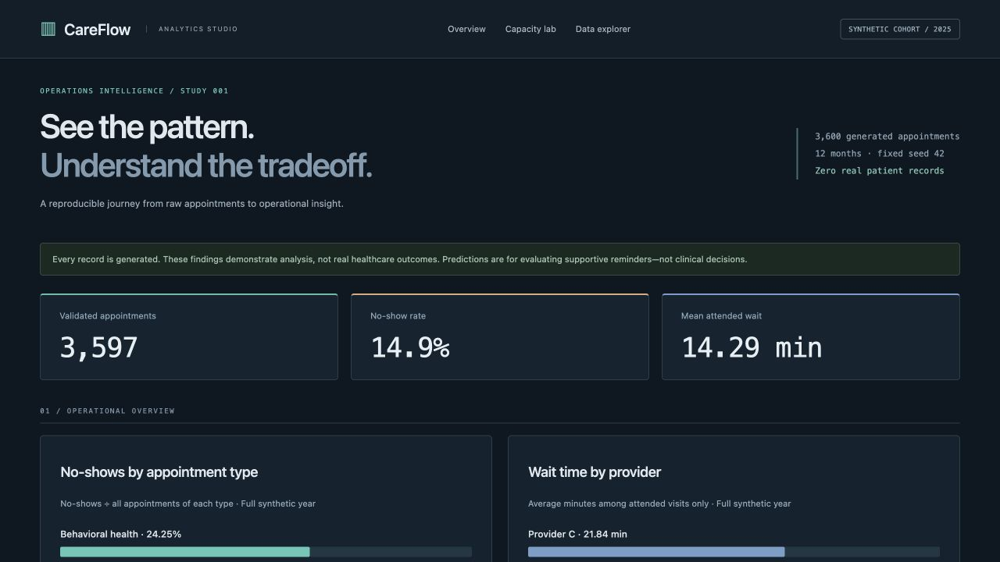
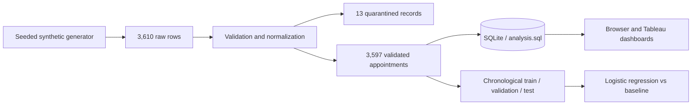

# Healthcare Operations Analytics

## Version 2: an operations analytics studio



- A dark BI layout with cyan operational charts, amber capacity figures, monospaced measures, and separate overview, capacity lab and data explorer sections.
- Validation-only precision/recall curves, holdout risk-bin counts, signed feature coefficients, and an interactive capacity comparison. Accessible chart descriptions and a threshold-value table accompany the plots.
- Fixed the report-without-database test bug: `create_app(data_dir=...)` supports a temporary dataset, and API tests generate their own database. A stale report alone still produces an explicit setup error rather than silently creating an empty database.
- **8 automated tests passed** on Python 3.13. Ruff lint/format, JavaScript syntax, pipeline regeneration and Tableau package checks pass. Desktop/phone browser checks covered chart rendering, capacity selection and provider filtering.

### A capacity-constrained operating question

“If reviewers can inspect at most 20% of this holdout cohort, how many observed no-shows are in the highest-risk queue?”

For seed 42, the holdout has **592** visits and **81** no-shows. A strict top-20% cap allocates **118** slots and captures **34** observed no-shows: **28.8% precision**, **42.0% recall**, and **2.11×** the random-selection expectation. Ties use appointment ID; ranking never uses the outcome label. Other capacity levels are labeled retrospective sensitivity analyses, not tuning of the model on holdout outcomes.

This cap differs from the fixed probability threshold: the threshold was selected on validation data to target roughly 20%, then flags **16.6%** of holdout visits unchanged. The UI explains this difference. Capacity spans the full Nov–Dec cohort; it is not a daily staffing model or a forecast of prevented no-shows. No intervention was simulated.

The coefficient display distinguishes standardized numeric effects from one-hot category coefficients; comparisons are descriptive, not causal or clinical.

A reproducible study of synthetic appointment operations: generate messy records, validate them, query the clean data in SQL, explore a dashboard, and evaluate a basic no-show prediction model.

The question is practical: where might an operations team investigate appointment attendance and waiting time? Every record is fictional. The study makes no claims about real patients, providers or healthcare outcomes.

## Run it

Requires Python 3.12+ (the pinned NumPy release requires it).

```sh
python3 -m venv .venv
source .venv/bin/activate
python -m pip install -r requirements.txt
python pipeline.py
python build_tableau.py
python -m uvicorn app:app --host 127.0.0.1 --port 8103
```

On Windows, use `.venv\Scripts\activate`. Open <http://127.0.0.1:8103>. The interactive browser dashboard shows full-year charts, three business findings, quality counts, model results and a filterable appointment table. `/docs` exposes the read-only API.

`tableau/CareFlow.twbx` is a packaged native Tableau workbook containing the same validated CSV and a three-chart dashboard. The original project documented a visual check in Tableau Desktop 2026.2; this update regenerated the package and checked its XML/data consistency, but did not re-open Tableau Desktop. The unpacked `.twb` and relative `Data/` source are also included for inspection. Regenerate both data and workbook together after changes.

The original validation installation used Desktop Free Edition. Its sharing restrictions differ from Tableau Public and Professional; use an appropriately licensed edition before sharing the native workbook. See [Tableau's edition comparison](https://help.tableau.com/current/pro/desktop/en-us/desktop_comparison.htm). The Python source, synthetic CSVs and browser dashboard can be reviewed separately.

## Data path



The generator creates 3,600 appointments in 2025, then adds ten duplicates and selected dirty values. Cleaning normalizes category labels, validates dates and ranges, checks outcomes, quarantines invalid rows with a source-row number and reason, and keeps missing ages as `Unknown`. Wait time is null for no-shows; it is never imputed as zero for operations reporting.

The generator deliberately makes longer booking windows, previous missed visits and some appointment types associated with no-shows. These are simulated assumptions, not discoveries about healthcare.

## Findings and evaluation

See [the three generated business findings](data/findings.md), [SQL queries](analysis.sql), [full report](data/report.json) and [quarantine](data/quarantine.csv). Each finding includes its denominator and a cautious operational next step.

The model uses logistic regression and only fields assumed known at the day-before-appointment scoring cutoff. Waiting time, final outcome, no-show labels and identifiers are excluded from predictors. Preprocessing is fitted on training rows only.

| Partition | Period | Purpose |
|---|---|---|
| Train | January–August | Fit preprocessing and model |
| Validation | September–October | Select a threshold targeting about 20% for reminder review |
| Test | November–December | Evaluate once using the unchanged threshold |

With seed 42, holdout ROC-AUC is **0.6857** against **0.5000** for a training-prevalence baseline. Average precision is **0.3070**, and Brier score is **0.1102**. The report also records baseline metrics, precision, recall, the confusion matrix, flagging rate, coefficients and descriptive age-group results. These modest synthetic results do not establish real-world usefulness, calibration or fairness.

There is one synthetic appointment per fictional patient. A real repeated-patient dataset would need patient-aware splitting and time-correct history features. Age group is included to demonstrate categorical handling and subgroup inspection, not to justify different access to care. Potential use is supportive reminder outreach; never deny or deprioritize care based on this model.

## Reproduce the checks

```sh
python -m pip install -r requirements-dev.txt
python -m ruff check .
python -m ruff format --check .
node --check static/app.js
python -m pytest -q
```

Tests verify reproducibility, quarantine reasons, outcome consistency, chronology, predictor exclusions, invariance to post-visit wait data, SQL/report agreement and parameterized API filters. `data/appointments.sqlite` is generated locally and ignored; the public CSVs contain synthetic records only. There is no external patient source or connection to a healthcare system.

## Files to explore

- `operations.py`: validation diagnostics, holdout distributions and capacity-capped ranking metrics.
- `pipeline.py`: generation, cleaning, model evaluation and report production.
- `analysis.sql`: reproducible operations questions and correct denominators.
- `data/`: synthetic CSV inputs/outputs, holdout predictions and report.
- `build_tableau.py` and `tableau/`: native workbook builder and packaged data.
- `app.py` and `static/`: interactive dashboard and read-only API.

The dashboard intentionally separates full-year descriptive analysis from held-out predictive evaluation. Filtering the record explorer updates its own cohort totals; it does not silently change the model's reported test set.
